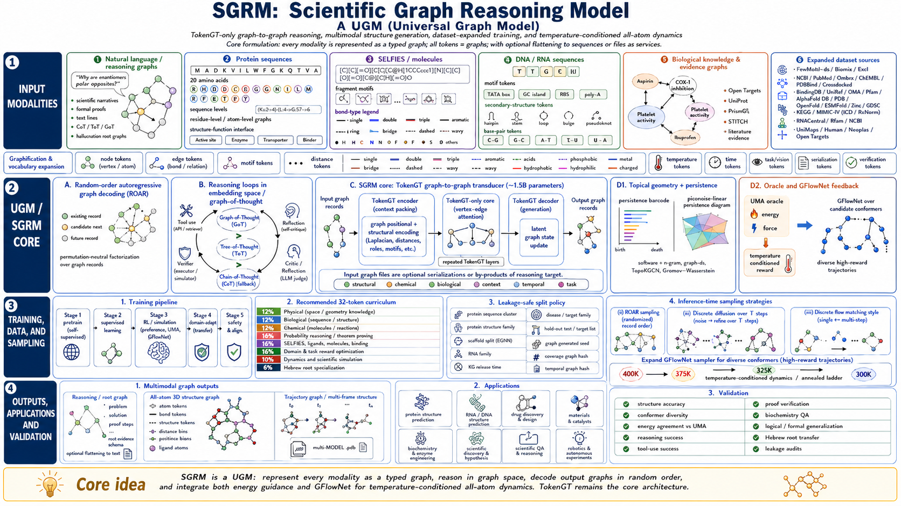

# Iska Universal Graph Model Scaffold



This repo is a training scaffold for a **Universal Graph Model (UGM)**: a TokenGT-style graph-to-graph model type for language, reasoning, tools, SELFIES/SMILES molecules, proteins, DNA/RNA, graph-state reasoning, and temperature-conditioned UMA-oracle feedback.

The implemented path is intentionally practical for one RTX 4090: graph-rich examples, a compact TokenGT-style transformer, random-order autoregressive graph-token decoding, staged training, validation, inference, and a local GFlowNet trajectory-balance stage.

## What Is Implemented

- Typed graph JSON schema for language, math, proof, code, tool, and molecule examples.
- Dataset acquisition manifest and small downloaded samples in `data/raw/`.
- Graphification scripts for synthetic, math, code, Lean/proof, and molecule rows.
- Random-order autoregressive decoding with `<POS>` query tokens.
- Compact TokenGT-style model using node/edge endpoint identifier embeddings, optional gradient checkpointing, and local LoRA adapters.
- Training runner with tqdm, JSONL metrics, checkpoints, resume support, validation, AMP, gradient clipping, schedulers, and optional W&B.
- Topology summaries, tropical logit diagnostics, verifier adapters, and curation tooling.
- Domain vertical slices for code/unit tests, Lean availability/compile checks, and RDKit-backed molecule graphs when RDKit is installed.
- PLAN-D/PLAN-G science-data slices for SFM/NatureLM reference vocabulary and UniGenX-style molecule/material graphs.
- PLAN-E Hebrew morphology/root slices with UD Hebrew HTB, Hebrew QA, Nakdimon diacritization, root-template graphs, and root-extension GFlowNet training.
- PLAN-F/PLAN-G deferred-component closure: optional advanced topology backends, tropical attention/parser utilities, numeric diffusion targets, audio feature extraction, local SFM/NatureLM and UniGenX science-source preparation, bioactivity/docking/protein graphification, safer verifier execution, stronger curation, and context-aware learned-backward GFlowNets.
- PLAN-H UGM multimodal graph-to-graph phase: sequence-first vocabulary for text/protein/SELFIES/SMILES/DNA/RNA/tool/oracle records, local-source preparation, continuous temperature conditioning, UMA-conditioned coupling/motion bins, function-description alignment, and oracle-feedback GFlowNet rewards.
- Full motif vocabulary path for sequence-first multimodal training: PROSITE, InterPro, Rfam, core sequence motifs, safe `SEQ_MOTIF_FROM_STRUCTURE:*` vocabulary entries, and optional non-structure molecule descriptors are parsed into graph-record vocabulary tokens; row-local structure motifs from coordinates/contact labels are evaluation/future-phase only.
- Structure/dynamics sources are validation-only by default. Actual PDB/mmCIF/SDF/trajectory, coordinate, energy, and force training remains disabled unless a later explicit phase enables it.
- Verifier-aware GFlowNet graph-of-thought trajectory-balance trainer plus rollout validation.
- Config-driven validation and inference CLIs.
- Smoke tests.
- `torchgfn` cloned under `data/external_repos/torchgfn` for reference.

## Environment

Create the project environment:

```bash
bash scripts/setup_conda_env.sh
conda activate iska-ugm
```

The implementation was also smoke-tested in the existing `tokengt` conda env:

```bash
conda run -n tokengt pytest -q
```

Check local readiness, including CUDA, optional domain packages, Lean, SFM/UniGenX repos, and reference-token files:

```bash
conda run -n tokengt python scripts/check_readiness.py
```

## Data

Generate deterministic synthetic graph data:

```bash
conda run -n tokengt python scripts/graphify_data.py \
  --synthetic --count 512 \
  --output data/processed/synthetic_graphs/train.jsonl
```

Acquire a small public sample:

```bash
conda run -n tokengt python scripts/acquire_datasets.py \
  --dataset gsm8k_main_train --limit 64
```

Graphify a raw sample:

```bash
conda run -n tokengt python scripts/graphify_data.py \
  --input data/raw/gsm8k_main_train/train.jsonl \
  --output data/processed/gsm8k_main_train/train.jsonl \
  --dataset-name gsm8k_main_train
```

Curate, deduplicate, and split graphified data:

```bash
conda run -n tokengt python scripts/curate_data.py \
  --input data/processed/mixed_graphs/train.jsonl \
  --output-dir data/processed/curated_graphs \
  --val-ratio 0.1 \
  --test-ratio 0.1 \
  --near-dedup-threshold 0.9 \
  --blocked-license-pattern "noncommercial"
```

Dataset details are in `planning/DATASETS.md` and `data/manifests/datasets.yaml`.

The executable dataset catalog plan is in `planning/DATASET-CATALOG-IMPLEMENTATION-PLAN.md`. Validate the catalog after any manifest, acquisition, graphification, vocabulary, or split change:

```bash
conda run -n tokengt python scripts/validate_dataset_catalog.py --no-progress
```

This writes `data/manifests/dataset_catalog_status.json` and `planning/DATASET-CATALOG-STATUS.md`. The previous completed public-corpus baseline had 19 active public Hugging Face parquet entries, 7,328,008 graph examples, and 1,107,708,497 untruncated model-sequence graph tokens. The current expanded default selection adds ranked graph-reasoning, scientific sequence/function, math verifier, and curated general text sources under a 5B untruncated graph-token guard.

The highest-priority additions are included by default in `data/manifests/datasets.yaml`: OpenAI GraphWalks, GraphWiz GraphInstruct-RFT-72K, PubChem10M SELFIES, UniProt function text descriptions, Rfam, RNAcentral, DNA coding regions, OpenMathReasoning TIR, OpenMathReasoning GenSelect, and a DCLM baseline 1B slice. GraphWalks is intentionally first because it most directly trains long-context graph-state reasoning. The largest additions are row-capped from Dataset Viewer sample estimates: PubChem10M SELFIES at 8M rows, Rfam at 1M, RNAcentral and DNA coding at 500k each, OpenMathReasoning TIR at 1.3M, and GenSelect at 300k.

Run the complete full selected-corpus training sequence with live tqdm streaming, per-stage logs, a master log, progress/status files, and runner-level W&B events:

```bash
scripts/run_full_training_sequence.sh
```

For the full phase 1 plus phase 2 curriculum, use the wrapper with the correct default budget, structure-training gate, W&B online logging, and training-first behavior:

```bash
./scripts/run_full_phase1_phase2_training.sh
```

To hold the same corpus, objectives, context limits, validation cadence, UMA preflight, and runner behavior while using the 250M-parameter UGM config, run:

```bash
./scripts/run_full_phase1_phase2_training_250m.sh
```

The script writes to `logs/full_training_sequence/<RUN_ID>/` and updates `logs/full_training_sequence/latest`. It uses `data/processed/real_full_selected_mix/`, honors manifest-local row caps such as the RNA/DNA caps, enforces `MAX_GRAPH_TOKENS=5000000000` by default, and generates a context config at `config/generated/real_full_selected_context_2x.yaml` so the model context is roughly 2x the largest row. The phase wrapper defaults to `TRAINING_FIRST=1`, `SKIP_REFERENCE_REFRESH_IF_READY=1`, `SKIP_INTERPRO_MOTIF_DOWNLOAD=1`, and `REQUIRE_UMA_WEIGHTS=1`, so if the graph corpus and reference vocabularies already exist it proceeds to training while still verifying/downloading the required FairChem/UMA weights before oracle stages. Phase-1 training is full-corpus by default: the runner writes a per-run override with `max_steps: full_epoch` and `FULL_TRAIN_EPOCHS=1.0`, so optimizer steps are computed from the actual train split length, batch size, and gradient accumulation rather than from a fixed smoke-test cap. Training stages automatically append `config/train/overrides/wandb_online.yaml`; shell stages and commands also log W&B runner events when `WANDB_ENABLED=1`.

Common controls:

```bash
DRY_RUN=1 scripts/run_full_training_sequence.sh
START_AT=03 scripts/run_full_training_sequence.sh
STOP_AFTER=02 scripts/run_full_training_sequence.sh
VALIDATION_DEVICE=cpu scripts/run_full_training_sequence.sh
MAX_GRAPH_TOKENS=4500000000 scripts/run_full_phase1_phase2_training.sh
WANDB_MODE=offline scripts/run_full_phase1_phase2_training.sh
WANDB_ENABLED=0 scripts/run_full_phase1_phase2_training.sh
UMA_SCORE_SMOKE=1 scripts/run_full_phase1_phase2_training.sh
FULL_TRAIN_EPOCHS=2.0 scripts/run_full_phase1_phase2_training.sh
FULL_TRAIN_EVAL_MAX_BATCHES=full scripts/run_full_phase1_phase2_training.sh
FULL_TRAIN_NUM_WORKERS=12 FULL_TRAIN_PREFETCH_FACTOR=6 scripts/run_full_phase1_phase2_training.sh
FULL_TRAIN_BATCH_SIZE=6 FULL_TRAIN_GRAD_ACCUM=6 ./scripts/run_full_phase1_phase2_training_250m.sh
./scripts/train_full_selected_250m_direct.sh
FULL_TRAIN_MAX_STEPS=20 ./scripts/train_full_selected_250m_direct.sh
MODEL_CONFIG=config/model/ugm_250m_tokengt.yaml scripts/run_full_phase1_phase2_training.sh
TRAINING_FIRST=0 SKIP_INTERPRO_MOTIF_DOWNLOAD=0 scripts/run_full_phase1_phase2_training.sh
```

Audit dataset sizes against the local machine before scaling:

```bash
conda run -n tokengt python scripts/audit_dataset_capacity.py
```

The audit writes `planning/DATASET-CAPACITY-AUDIT.md` and `data/manifests/dataset_capacity_audit.json`. On the current machine, the manifest sees about 2.5 TB free disk after downloads, about 49.6 GB available RAM, and an RTX 4090 with 24 GB VRAM.

Download the full public Hugging Face selected splits named by the manifest into parquet snapshots:

```bash
conda run -n tokengt python scripts/download_hf_selected_splits.py \
  --manifest data/manifests/datasets.yaml \
  --out-dir data/raw_hf_full \
  --max-total-gib 32
```

The expanded selected-split snapshot is expected to be materially larger than the old 2.8 GB baseline. Manifest-only entries, local-file entries, gated/very large entries, and user-provided reconstruction sources are not bulk-downloaded by this command.

Build the full real-data graph corpus from the downloaded parquet snapshots. This command honors manifest-local row caps and reports global, per-dataset, and per-parquet-file tqdm progress with live split, dataset, and error counters:

```bash
conda run -n tokengt python scripts/graphify_full_parquet_manifest.py \
  --manifest data/manifests/datasets.yaml \
  --raw-full-dir data/raw_hf_full \
  --output-dir data/processed/real_full_selected_mix \
  --val-ratio 0.01 \
  --test-ratio 0.01 \
  --batch-size 8192 \
  --progress-every 10000
```

Count full-corpus graph tokens and enforce the 5B untruncated graph-token cap:

```bash
conda run -n tokengt python scripts/count_graph_tokens.py \
  --data-dir data/processed/real_full_selected_mix \
  --output data/processed/real_full_selected_mix/token_counts.json \
  --progress-every 100000 \
  --max-model-sequence-tokens-total 5000000000
```

Generate the context-window audit and 2x context config:

```bash
conda run -n tokengt python scripts/inspect_context_requirements.py \
  --data-dir data/processed/real_full_selected_mix \
  --output data/processed/real_full_selected_mix/context_requirements.json \
  --context-multiplier 2.0 \
  --write-context-config config/generated/real_full_selected_context_2x.yaml
```

Verify that the split files on disk match `summary.json` before training. This catches interrupted graphification runs:

```bash
conda run -n tokengt python scripts/check_dataset_integrity.py \
  --data-dir data/processed/real_full_selected_mix \
  --output data/processed/real_full_selected_mix/integrity.json
```

After a completed integrity-checked graphification, the full public selected-split graph corpus is `data/processed/real_full_selected_mix/`. The old baseline counts are preserved in `planning/FULL-PRETRAINING-DATASET.md`; the expanded counts are produced by the next full run and must report `within_model_sequence_token_budget: true` before training starts.

When the 4090 is free, train on the full selected corpus. The default full selected-corpus training config now uses one full pass over the train split:

```bash
conda run -n tokengt python scripts/train_stage.py \
  --config config/model/max_4090_tokengt.yaml \
  --config config/data/real_full_selected_mix.yaml \
  --config config/generated/real_full_selected_context_2x.yaml \
  --config config/train/real_full_selected_local.yaml
```

`config/train/real_full_selected_local.yaml` sets `max_steps: full_epoch` and `full_epochs: 1.0`. For the current corpus this resolves to about 224k optimizer steps with `batch_size: 1` and `gradient_accumulation_steps: 32`, i.e. one pass over all 7,181,690 train examples. In-training validation is intentionally capped with `eval_max_batches: 512`; the stage still runs full validation and test after training through `scripts/validate_stage.py`. The full runner defaults to eight train DataLoader workers, pinned memory, persistent workers, and prefetching because the full corpus is an 83GB JSONL file and CPU graph parsing can otherwise leave the GPU underfed. Phase-1 full-corpus training backpropagates the token objective only; topology and numeric-diffusion values remain logged as diagnostics, while weighted topology/numeric auxiliary losses are reserved for later normalized ablation stages. The trainer fails fast and writes an emergency checkpoint if any loss becomes non-finite.

The 250M setup uses `config/model/ugm_250m_tokengt.yaml`, `config/data/real_full_selected_mix_250m.yaml`, `config/train/real_full_selected_250m_local.yaml`, `config/validate/real_full_selected_250m_validation.yaml`, `config/validate/real_full_selected_250m_test.yaml`, and `config/inference/real_full_selected_250m_inference.yaml`. Its artifacts live under `outputs/real_full_selected_250m_local/` so it can be trained beside the default 576M run. A synthetic CUDA probe at 926 graph tokens found `batch_size: 7` fits and `batch_size: 8` OOMs, but real shuffled training OOMed at batch 7, so the production 250M defaults are `batch_size: 6`, `eval_batch_size: 6`, and `gradient_accumulation_steps: 6`. After the corpus, UMA weights, and vocab have already been checked or built once, `./scripts/train_full_selected_250m_direct.sh` jumps straight to `train_stage.py` with the same 250M configs, reuses the existing vocab, and skips the full runner preamble. Its `SKIP_POLICY_CHECK=1` default should only be used after the same unchanged corpus has passed the full sequence-only policy scan.

### Sequence-First Multimodal And FairChem/UMA Oracle Conditioning

The current multimodal phase uses local sequence/string exports from `data/local/multimodal/`. The `--synthetic-if-empty` flag is reserved for smoke tests only; production training should omit it so missing reviewed rows fail visibly. First-run molecular training is SELFIES/SMILES and protein/DNA/RNA sequence-first: actual structure files, coordinate trajectories, energies, and forces are excluded from supervised training.

Temperature conditioning is continuous over roughly `300K..400K`. The graphifier stores both stable anchor/bin tokens and continuous Kelvin features, and FairChem/UMA oracle calls use that same continuous temperature when scoring candidate graph states.

Function-description training is part of the first curriculum. Use SFM/NatureLM-style sequence science rows, sanitized UniGenX sequence/function metadata, ProTrek-style protein sequence/function pairs, UniProt/InterPro/GO/EC annotations, and assay/target annotations as graph-to-graph function-description examples. These rows may include `function_description` and `sequence_motifs_from_structure`, but they must not include atoms, coordinates, contact maps, PDB/mmCIF/SDF files, energies, forces, or trajectories.

UMA influences graph-state evolution through fine-grained binned records only in the UMA candidate-scoring stage. Ordinary sequence reconstruction and function-description rows may carry temperature and function nodes, but they do not emit AF-style 64-bin `ATTN_BIN:*`, `TOKEN_COUPLING:uma:*`, `UMA_INFLUENCE:uma:*`, `TOKEN_MOTION:uma:*`, `UMA_TRAJ_BIN:*`, or `SEQ_STRUCT_DYN_PROXY:*` targets unless an oracle stage flag or structure-dynamics task is active. In that stage, GFlowNet training learns temperature-conditioned coupling, motion, and trajectory policies from SELFIES/FASTA inputs only.

The stage is still aimed at actual structure-dynamics generation. The model should propose typed atom/bond/coordinate/frame graph records; the restriction is that those predictions are trained through UMA/verifier/GFlowNet feedback rather than supervised copying of structure files, energy/force labels, or MD frames. Generated-token PDB rendering is optional and not required for this pass.

Mechanistically, the UMA stage treats evolving attention maps as contact fields. Attention couplings are fused with Euclidean hidden-state geometry and Jensen-Shannon distance after hidden-state softmax to form sequence-conditioned contact estimates; generated coordinate/frame records are checked for consistency with those estimates before FairChem/UMA reward and GFlowNet trajectory balance reinforce the graph-state path.

The live UMA backend is FairChem from the Amelie Schreiber fork at `data/external_repos/fairchem`. Repository acquisition alone does not download gated UMA weights. To run real oracle scoring, install/resolve FairChem dependencies, request access to `facebook/UMA` on Hugging Face, authenticate with `hf auth login`, and resolve the default UMA-S-1.2 checkpoint plus OMol reference tables:

```bash
conda run -n tokengt python scripts/acquire_model_files.py --repo-name fairchem

conda run -n tokengt python scripts/download_uma_weights.py \
  --repo data/external_repos/fairchem \
  --model-name uma-s-1p2 \
  --task-name omol \
  --device cuda

conda run -n tokengt python scripts/check_uma_oracle.py \
  --repo data/external_repos/fairchem \
  --smiles "CCO" \
  --temperature 325 \
  --backend fairchem \
  --strict
```

`scripts/download_uma_weights.py` uses FairChem's model registry and Hugging Face cache, downloading `facebook/UMA` files when they are absent and reporting their resolved local paths. The full training runners call this preflight when `REQUIRE_UMA_WEIGHTS=1`; set `UMA_SCORE_SMOKE=1` to run a strict `CCO` ASE/FairChem scoring check before training. `UGM_UMA_BACKEND=proxy` is available only for unit tests and local smoke checks that must not download gated UMA weights. The production oracle GFlowNet configs use `oracle.backend: fairchem` with `strict: true`, so a missing FairChem clone, missing Hugging Face access, or invalid candidate causes a clear failure rather than silent proxy scoring.

```bash
conda run -n tokengt python scripts/prepare_multimodal_sources.py \
  --input-dir data/local/multimodal \
  --synthetic-if-empty \
  --molecular-input-policy sequence_only \
  --output data/processed/multimodal_graphs/all.jsonl

conda run -n tokengt python scripts/curate_data.py \
  --input data/processed/multimodal_graphs/all.jsonl \
  --output-dir data/processed/multimodal_graphs \
  --val-ratio 0.2 \
  --test-ratio 0.1

conda run -n tokengt python scripts/train_stage.py \
  --config config/model/max_4090_tokengt.yaml \
  --config config/data/multimodal_graphs_4090.yaml \
  --config config/train/multimodal_phase2_4090.yaml

conda run -n tokengt python scripts/validate_stage.py \
  --config config/validate/multimodal_4090_validation.yaml

conda run -n tokengt python scripts/validate_stage.py \
  --config config/validate/multimodal_4090_test.yaml

conda run -n tokengt python scripts/check_dataset_policy.py \
  --data-dir data/processed/multimodal_graphs \
  --sequence-only-molecules

conda run -n tokengt python scripts/train_stage.py \
  --config config/data/multimodal_graphs_4090.yaml \
  --config config/train/multimodal_oracle_gflownet_4090.yaml
```

### PLAN-D/PLAN-G Science Data

The corrected science references are SFM/NatureLM (`https://github.com/amelie-iska/SFM`, paper `https://arxiv.org/abs/2502.07527`) and UniGenX (`https://github.com/amelie-iska/UniGenX`, paper `https://arxiv.org/abs/2503.06687`).

Clone the corrected SFM/NatureLM and UniGenX reference repositories and extract their domain/token dictionaries into the training vocabulary:

```bash
conda run -n tokengt python scripts/acquire_model_files.py --repo-name sfm
conda run -n tokengt python scripts/acquire_model_files.py --repo-name unigenx

conda run -n tokengt python scripts/extract_reference_tokens.py \
  --sfm-dir data/external_repos/sfm \
  --unigenx-dir data/external_repos/unigenx \
  --output data/processed/reference_tokens/naturelm_unigenx_tokens.txt
```

Acquire tiny UniGenX-style public samples:

```bash
conda run -n tokengt python scripts/acquire_datasets.py \
  --dataset unigenx_qm9_train --limit 4

conda run -n tokengt python scripts/acquire_datasets.py \
  --dataset unigenx_materials_crystal_system --limit 4
```

### PLAN-E Hebrew Data

Acquire tiny Hebrew HF samples:

```bash
for ds in \
  hebrew_sefaria_train \
  hebrew_synthetic_medical_train \
  hebrew_wikianswers_lists \
  hebrew_wikianswers_queries \
  hebrew_alpaca_train \
  talmud_hebrew_train \
  hebrew_wikipedia_train
do
  conda run -n tokengt python scripts/acquire_datasets.py --dataset "$ds" --limit 8
done
```

Clone structured Hebrew repositories:

```bash
conda run -n tokengt python scripts/acquire_datasets.py --dataset hebrew_ud_htb
conda run -n tokengt python scripts/acquire_datasets.py --dataset hebrew_qa_nnlp
conda run -n tokengt python scripts/acquire_datasets.py --dataset hebrew_nakdimon
```

Graphify HF rows, then prepare UD/QA/Nakdimon/root-extension data:

```bash
conda run -n tokengt python scripts/graphify_data.py \
  --input data/raw/hebrew_alpaca_train/train.jsonl \
  --output data/processed/hebrew_alpaca_train/train.jsonl \
  --dataset-name hebrew_alpaca_train

conda run -n tokengt python scripts/prepare_hebrew_sources.py \
  --ud-limit 16 --qa-limit 16 --nakdimon-limit 8 --root-count 32
```

Merge the Hebrew graph sources into a training mix:

```bash
conda run -n tokengt python scripts/merge_jsonl.py \
  --input data/processed/hebrew_sefaria_train/train.jsonl \
  --input data/processed/hebrew_synthetic_medical_train/train.jsonl \
  --input data/processed/hebrew_wikianswers_lists/train.jsonl \
  --input data/processed/hebrew_wikianswers_queries/train.jsonl \
  --input data/processed/hebrew_alpaca_train/train.jsonl \
  --input data/processed/talmud_hebrew_train/train.jsonl \
  --input data/processed/hebrew_wikipedia_train/train.jsonl \
  --input data/processed/hebrew_ud_htb/train.jsonl \
  --input data/processed/hebrew_qa_nnlp/train.jsonl \
  --input data/processed/hebrew_nakdimon/train.jsonl \
  --input data/processed/hebrew_root_synthetic/train.jsonl \
  --output data/processed/hebrew_mix/all.jsonl

conda run -n tokengt python scripts/curate_data.py \
  --input data/processed/hebrew_mix/all.jsonl \
  --output-dir data/processed/hebrew_mix \
  --val-ratio 0.15 \
  --test-ratio 0.0
```

The Verb Complements Lexicon is manifest-only until an official downloadable source is provided. If a TSV/CSV with `verb_root`, `verb_binyan`, `verb_LexiconItem`, and `complement_LexiconItem` columns is placed under `data/raw/hebrew_verb_complements_lexicon/`, `scripts/prepare_hebrew_sources.py` will ingest it.

Refresh SFM and UniGenX GitHub metadata:

```bash
conda run -n tokengt python scripts/acquire_model_files.py \
  --repo-name sfm

conda run -n tokengt python scripts/acquire_model_files.py \
  --repo-name unigenx
```

Graphify and curate the tiny science mix:

```bash
conda run -n tokengt python scripts/graphify_data.py \
  --input data/raw/unigenx_qm9_train/train.jsonl \
  --output data/processed/unigenx_qm9_train/train.jsonl \
  --dataset-name unigenx_qm9_train

conda run -n tokengt python scripts/graphify_data.py \
  --input data/raw/unigenx_materials_crystal_system/train.jsonl \
  --output data/processed/unigenx_materials_crystal_system/train.jsonl \
  --dataset-name unigenx_materials_crystal_system

conda run -n tokengt python scripts/merge_jsonl.py \
  --input data/processed/unigenx_qm9_train/train.jsonl \
  --input data/processed/unigenx_materials_crystal_system/train.jsonl \
  --output data/processed/science_mix/all.jsonl

conda run -n tokengt python scripts/curate_data.py \
  --input data/processed/science_mix/all.jsonl \
  --output-dir data/processed/science_mix \
  --val-ratio 0.2 \
  --test-ratio 0.0
```

### PLAN-F Deferred Science Paths

Acquire and prepare the tractable official NatureLM/SFM public-source slices. This downloads PubChem extras, UniProt Swiss-Prot, selected RefSeq slices, records Materials Project as API-gated when `MP_API_KEY` is absent, and graphifies the non-large selected sources into train/validation/test JSONL splits. The default split policy is entity-aware for scientific data; pass `--split-policy row_hash` only for smoke tests that intentionally use row-level splitting.

```bash
conda run -n tokengt python scripts/acquire_naturelm_sources.py \
  --prepare \
  --val-ratio 0.01 \
  --test-ratio 0.01 \
  --log-dir logs/naturelm_acquisition \
  --wandb-mode offline

conda run -n tokengt python scripts/check_dataset_integrity.py \
  --data-dir data/processed/naturelm_public_sources \
  --output data/processed/naturelm_public_sources/integrity.json

conda run -n tokengt python scripts/count_graph_tokens.py \
  --data-dir data/processed/naturelm_public_sources \
  --line-counts \
  --output data/processed/naturelm_public_sources/token_counts.json

conda run -n tokengt python scripts/check_identifier_stats.py \
  --data-dir data/processed/naturelm_public_sources \
  --output data/processed/naturelm_public_sources/identifier_stats.json

conda run -n tokengt python scripts/inspect_context_requirements.py \
  --data-dir data/processed/naturelm_public_sources \
  --context-multiplier 2.0 \
  --output data/processed/naturelm_public_sources/context_requirements.json \
  --write-context-config config/generated/naturelm_public_sources_context_2x.yaml
```

If a corpus was prepared with an older row-hash split, resplit it without re-graphifying the raw sources:

```bash
conda run -n tokengt python scripts/resplit_graph_jsonl.py \
  --input-dir data/processed/naturelm_public_sources \
  --output-dir data/processed/naturelm_public_sources_entity \
  --split-policy entity \
  --val-ratio 0.01 \
  --test-ratio 0.01
```

Large paths are deliberately explicit. Full PubChem CID-SMILES graphification requires `--prepare-large`; UniProt TrEMBL requires `--include-large --prepare-large`; Materials Project requires `MP_API_KEY` plus a local API export.

```bash
conda run -n tokengt python scripts/train_stage.py \
  --config config/model/max_4090_tokengt.yaml \
  --config config/data/naturelm_public_sources_entity.yaml \
  --config config/generated/naturelm_public_sources_context_2x.yaml \
  --config config/train/real_full_selected_local.yaml
```

Acquire and graphify a small public protein/ligand binding sample:

```bash
conda run -n tokengt python scripts/acquire_datasets.py \
  --dataset binding_affinity_public --limit 16

conda run -n tokengt python scripts/graphify_data.py \
  --input data/raw/binding_affinity_public/train.jsonl \
  --output data/processed/binding_affinity_public/train.jsonl \
  --dataset-name binding_affinity_public
```

Prepare local SFM/NatureLM and UniGenX-style sources without reconstructing huge corpora by default:

```bash
conda run -n tokengt python scripts/prepare_science_sources.py \
  --kind uniprot \
  --input /path/to/uniprot.fasta \
  --output data/processed/local_uniprot/train.jsonl \
  --limit 1000

conda run -n tokengt python scripts/prepare_science_sources.py \
  --kind bindingdb \
  --input /path/to/BindingDB.tsv \
  --output data/processed/local_bindingdb/train.jsonl \
  --limit 1000

conda run -n tokengt python scripts/prepare_science_sources.py \
  --kind pdbbind \
  --input /path/to/pdbbind_rows.jsonl \
  --output data/processed/local_pdbbind/train.jsonl
```

For sequence/function-description alignment, use the sequence-only kinds:

```bash
conda run -n tokengt python scripts/prepare_science_sources.py \
  --kind protrek \
  --input /path/to/protrek_or_function_pairs.jsonl \
  --dataset-name protrek_sequence_function \
  --output data/processed/protrek_sequence_function/all.jsonl

conda run -n tokengt python scripts/prepare_science_sources.py \
  --kind naturelm \
  --input /path/to/sfm_or_naturelm_sequence_function.jsonl \
  --dataset-name naturelm_sequence_function \
  --output data/processed/naturelm_sequence_function/all.jsonl

conda run -n tokengt python scripts/prepare_science_sources.py \
  --kind protein_function \
  --input /path/to/unigenx_sequence_function.jsonl \
  --dataset-name unigenx_sequence_function \
  --output data/processed/unigenx_sequence_function/all.jsonl
```

Expected fields include `protein_sequence` or `sequence`, plus `function_description`, `function`, `description`, `annotation`, `summary`, `completion`, or `output`.

Supported `--kind` values include `pubchem`, `uniprot`, `refseq`, `ncbi`, `materials_project`, `chembl`, `bindingdb`, `bioactivity`, `pdbbind`, `docking`, and `ec`. These create graph-token rows for molecules, proteins, EC-number conditioning, protein-ligand docking, assay/bioactivity records, and materials.

Local audio feature extraction remains available for user-provided rows with `local_audio_path` or `audio_path`, but no external audio corpus is part of the active SFM/NatureLM or UniGenX pipeline.

Optional large NatureLM Hugging Face checkpoints remain explicit and are not pulled by the default GitHub metadata commands:

```bash
conda run -n tokengt python scripts/acquire_model_files.py --repo-name fairchem

conda run -n tokengt python scripts/download_uma_weights.py \
  --repo data/external_repos/fairchem \
  --model-name uma-s-1p2 \
  --task-name omol

conda run -n tokengt python scripts/acquire_model_files.py \
  --repo-name naturelm_8x7b_hf_checkpoint \
  --download \
  --pattern "README.md" \
  --max-file-mb 1
```

Use larger `--max-file-mb` and explicit `--pattern` values only when you intentionally want multi-GB checkpoint files.

### PLAN-H UGM Multimodal Graphs

Build the UGM reference-token extension and the actual motif vocabulary. This downloads public PROSITE, InterPro, CATH, and Rfam metadata into `data/raw_motifs/public/`, writes `data/processed/reference_tokens/motif_graph_tokens.txt`, and merges those motif tokens into `data/processed/reference_tokens/multimodal_graph_tokens.txt`:

```bash
conda run -n tokengt python scripts/build_multimodal_vocab.py \
  --download-public-motifs \
  --output data/processed/reference_tokens/multimodal_graph_tokens.txt
```

The current local full public motif build produced 74,789 motif records and 148,669 motif tokens: 55,644 sequence records, 10,987 structure records, and 8,158 structure-derived sequence records from core defaults, PROSITE, InterPro, CATH, and Rfam. Set `SKIP_INTERPRO_MOTIF_DOWNLOAD=1` only when intentionally doing a fast smoke run from already cached non-InterPro sources.

Create a neutral synthetic multimodal graph-to-graph smoke set:

```bash
conda run -n tokengt python scripts/prepare_multimodal_sources.py \
  --synthetic \
  --count 32 \
  --output data/processed/multimodal_graphs/all.jsonl

conda run -n tokengt python scripts/curate_data.py \
  --input data/processed/multimodal_graphs/all.jsonl \
  --output-dir data/processed/multimodal_graphs \
  --val-ratio 0.2 \
  --test-ratio 0.1
```

Prepare local JSON/JSONL/CSV/TSV/FASTA rows with first-run fields such as `protein_sequence`, `selfies`, `smiles`, `dna_sequence`, `rna_sequence`, `temperature`, `oracle`, `sequence_motifs`, `sequence_motifs_from_structure`, `function_description`, function labels, and assay/property annotations. Keep `atoms`, `bonds`, `frames`, `coordinates`, `energy`, `forces`, row-local `structure_motifs`, and row-local `structure_derived_sequence_motifs` out of training rows unless a later structure phase is explicitly enabled:

```bash
conda run -n tokengt python scripts/prepare_multimodal_sources.py \
  --input /path/to/mixed_rows.jsonl \
  --dataset-name local_multimodal_graph_to_graph \
  --molecular-input-policy sequence_only \
  --output data/processed/local_multimodal/train.jsonl \
  --limit 1000
```

## Train

Tiny graph pretraining:

```bash
conda run -n tokengt python scripts/train_stage.py \
  --config config/model/tiny_tokengt.yaml \
  --config config/data/synthetic_graphs.yaml \
  --config config/train/graph_pretrain_tiny.yaml
```

Tiny GFlowNet graph-of-thought stage:

```bash
conda run -n tokengt python scripts/train_stage.py \
  --config config/data/synthetic_graphs.yaml \
  --config config/train/gflownet_got_tiny.yaml
```

Tiny topology auxiliary stage:

```bash
conda run -n tokengt python scripts/train_stage.py \
  --config config/model/tiny_tokengt.yaml \
  --config config/data/synthetic_graphs.yaml \
  --config config/train/topology_aux_tiny.yaml
```

Graph-state evolution ablation for the first topology/persistence/tropical run. This compares baseline random-order graph decoding, graph/topology plus hidden-topology collapse guidance, tropical annealing, and the combined variant. It logs hidden-state distogram/H0-persistence proxies, graph topology summaries, tropical logit diagnostics, quality metrics, diversity proxies, and elapsed time per variant.

```bash
conda run -n tokengt python scripts/run_graph_state_ablation.py \
  --model-config config/model/tiny_tokengt.yaml \
  --data-config config/data/synthetic_graphs.yaml \
  --output outputs/graph_state_ablation/summary.json
```

Use `--dry-run` to print the exact variant commands without training. The graph-state implementation treats reasoning as an evolving graph with optional latent thought nodes and verifier/tool observations; chain-of-thought text is only a possible rendering of that state.

Code, Lean, and chemistry vertical-slice SFT smoke stages:

```bash
conda run -n tokengt python scripts/train_stage.py \
  --config config/model/tiny_lora_checkpointed.yaml \
  --config config/data/code_graphs.yaml \
  --config config/train/code_sft_tiny.yaml

conda run -n tokengt python scripts/train_stage.py \
  --config config/model/tiny_lora_checkpointed.yaml \
  --config config/data/lean_graphs.yaml \
  --config config/train/lean_sft_tiny.yaml

conda run -n tokengt python scripts/train_stage.py \
  --config config/model/tiny_lora_checkpointed.yaml \
  --config config/data/chem_graphs.yaml \
  --config config/train/chem_sft_tiny.yaml
```

PLAN-D science SFT smoke stage:

```bash
conda run -n tokengt python scripts/train_stage.py \
  --config config/model/tiny_lora_checkpointed.yaml \
  --config config/data/science_mix.yaml \
  --config config/train/science_sft_tiny.yaml
```

The PLAN-D/PLAN-F science config can enable the conditional numeric diffusion auxiliary head for non-structure numeric properties via `loss.numeric_diffusion_weight`. Direct coordinate, dynamics, energy, and force labels remain disabled for the first run.

PLAN-H UGM multimodal phase-2 4090 stage:

```bash
conda run -n tokengt python scripts/train_stage.py \
  --config config/model/max_4090_tokengt.yaml \
  --config config/data/multimodal_graphs_4090.yaml \
  --config config/train/multimodal_phase2_4090.yaml
```

PLAN-H oracle-feedback GFlowNet 4090 stage:

```bash
conda run -n tokengt python scripts/train_stage.py \
  --config config/data/multimodal_graphs_4090.yaml \
  --config config/train/multimodal_oracle_gflownet_4090.yaml
```

Structure/dynamics graph-to-graph phase is disabled for the first run. Do not run these training configs unless a later explicit structure-file phase is approved; the active structure-dynamics proxy path is the sequence-only multimodal/GFlowNet stage above.

```bash
# future-phase only:
# ENABLE_STRUCTURE_TRAINING=1 conda run -n tokengt python scripts/train_stage.py \
#   --config config/model/max_4090_tokengt.yaml \
#   --config config/data/structure_dynamics_graphs.yaml \
#   --config config/train/structure_dynamics_4090.yaml
```

PLAN-E Hebrew SFT and root-extension GFlowNet smoke stages:

```bash
conda run -n tokengt python scripts/train_stage.py \
  --config config/model/tiny_lora_checkpointed.yaml \
  --config config/data/hebrew_mix.yaml \
  --config config/train/hebrew_sft_tiny.yaml

conda run -n tokengt python scripts/train_stage.py \
  --config config/data/hebrew_roots.yaml \
  --config config/train/hebrew_root_gflownet_tiny.yaml
```

For 4090-scale experiments, start from:

```bash
config/model/max_4090_tokengt.yaml
config/model/ugm_250m_tokengt.yaml
```

With `max_vocab_size: 262144`, this profile is 576,767,128 trainable parameters with `max_seq_len: 1024`, `hidden_dim: 1024`, `num_layers: 24`, `num_heads: 16`, and `ffn_dim: 4096`.

The 250M UGM profile keeps `max_seq_len: 1024`, `max_nodes: 1024`, `max_slots: 256`, `numeric_dim: 16`, and `numeric_diffusion_steps: 64`, while using `hidden_dim: 768`, `num_layers: 6`, `num_heads: 12`, and `ffn_dim: 3072`. With the same 262,144-token vocabulary, it profiles at 249,783,448 trainable parameters.

The ready-to-run 4090 configs are:

```bash
config/train/science_sft_4090.yaml
config/train/hebrew_sft_4090.yaml
config/train/gflownet_got_4090.yaml
config/train/hebrew_root_gflownet_4090.yaml
config/train/multimodal_phase2_4090.yaml
config/train/multimodal_oracle_gflownet_4090.yaml
config/train/structure_dynamics_4090.yaml                # disabled future-phase gate
config/train/structure_dynamics_oracle_gflownet_4090.yaml # disabled future-phase gate
```

Use `planning/TRAINING-SEQUENCE.md` for the full start-to-finish training command sequence. Use `planning/RUNBOOK-4090.md` for additional 4090 scaling, W&B, validation, and inference notes. Check `planning/LICENSE-REVIEW.md` before increasing dataset limits.

## Validate

Config-driven validation:

```bash
conda run -n tokengt python scripts/validate_stage.py \
  --config config/validate/domain_validation.yaml \
  --device cpu
```

PLAN-D science validation:

```bash
conda run -n tokengt python scripts/validate_stage.py \
  --config config/validate/science_validation.yaml \
  --device cpu
```

PLAN-E Hebrew validation:

```bash
conda run -n tokengt python scripts/validate_stage.py \
  --config config/validate/hebrew_validation.yaml \
  --device cpu

conda run -n tokengt python scripts/validate_gflownet.py \
  --config config/data/hebrew_roots.yaml \
  --config config/train/hebrew_root_gflownet_tiny.yaml \
  --checkpoint outputs/hebrew_root_gflownet_tiny/gflownet_final.pt \
  --data data/processed/hebrew_root_synthetic/train.jsonl \
  --device cpu \
  --output outputs/hebrew_root_gflownet_tiny/validation.json
```

PLAN-H UGM multimodal validation:

```bash
conda run -n tokengt python scripts/validate_stage.py \
  --config config/validate/multimodal_4090_validation.yaml \
  --device cpu

conda run -n tokengt python scripts/validate_stage.py \
  --config config/validate/multimodal_4090_test.yaml \
  --device cpu

conda run -n tokengt python scripts/validate_gflownet.py \
  --config config/data/multimodal_graphs_4090.yaml \
  --config config/train/multimodal_oracle_gflownet_4090.yaml \
  --config config/validate/multimodal_4090_gflownet_validation.yaml \
  --device cpu
```

Structure/dynamics validation:

```bash
conda run -n tokengt python scripts/validate_stage.py \
  --config config/validate/structure_dynamics_validation.yaml \
  --device cpu

conda run -n tokengt python scripts/validate_stage.py \
  --config config/validate/structure_dynamics_test.yaml \
  --device cpu

conda run -n tokengt python scripts/validate_gflownet.py \
  --config config/data/structure_dynamics_graphs.yaml \
  --config config/train/structure_dynamics_oracle_gflownet_4090.yaml \
  --config config/validate/structure_dynamics_gflownet_validation.yaml \
  --device cpu
```

Full selected-corpus validation after the full checkpoint exists:

```bash
conda run -n tokengt python scripts/validate_stage.py \
  --config config/validate/real_full_selected_validation.yaml \
  --device cpu
```

Full selected-corpus test check:

```bash
conda run -n tokengt python scripts/validate_stage.py \
  --config config/validate/real_full_selected_test.yaml \
  --device cpu
```

The full selected-corpus validation/test configs point at `data/processed/real_full_selected_mix/` and the full checkpoint under `outputs/real_full_selected_local/`.

Repeatable quality assessment:

```bash
conda run -n tokengt python scripts/quality_assess.py
```

Direct validation:

```bash
conda run -n tokengt python scripts/validate_stage.py \
  --checkpoint outputs/synthetic_graph_pretrain/checkpoint_final.pt \
  --vocab outputs/synthetic_graph_pretrain/vocab.jsonl \
  --data data/processed/synthetic_graphs/train.jsonl \
  --batch-size 8 \
  --device cpu
```

Validate a saved GFlowNet rollout policy:

```bash
conda run -n tokengt python scripts/validate_gflownet.py \
  --config config/train/gflownet_got_tiny.yaml \
  --config config/validate/gflownet_validation.yaml \
  --device cpu
```

GFlowNet configs now support:

- `gflownet.use_context`: topology-conditioned policy inputs;
- `gflownet.learn_backward_policy`: learned backward policy instead of uniform reverse actions;
- `gflownet.subtrajectory_weight`: auxiliary subtrajectory-balance loss.

The saved checkpoint records the candidate token set, context dimension, forward policy, optional backward policy, trajectory-balance state, and subtrajectory-balance state.

## Inference

```bash
conda run -n tokengt python scripts/infer.py \
  --config config/inference/science_tiny_inference.yaml \
  --text "Create a graph reasoning sketch for a protein-to-molecule design task." \
  --max-steps 8 --retries 2 \
  --device cpu
```

UGM multimodal inference smoke:

```bash
conda run -n tokengt python scripts/infer.py \
  --config config/inference/multimodal_4090_inference.yaml \
  --prompt "Generate graph records for a mixed protein and ligand input." \
  --protein-sequence "MKTW" \
  --selfies "[C][=O][O]" \
  --dna-sequence "ATGC" \
  --temperature-k 315.5 \
  --max-steps 8 \
  --device cpu
```

The multimodal inference path also accepts `--multimodal-json` and `--multimodal-json-file /path/to/row.json`. For the first run, keep these rows sequence-first and avoid `atoms`, `bonds`, `frames`, `energy`, and `forces`.

Structure/dynamics inference is validation-only unless `ENABLE_STRUCTURE_TRAINING=1` is set deliberately:

```bash
conda run -n tokengt python scripts/infer.py \
  --config config/inference/structure_dynamics_inference.yaml \
  --multimodal-json-file path/to/example_structure_dynamics_row.json \
  --render-input-pdb \
  --device cpu \
  --output outputs/structure_dynamics_4090/infer_structure_dynamics_sequence.json
```

Full selected-corpus checkpoint inference:

```bash
conda run -n tokengt python scripts/infer.py \
  --config config/inference/real_full_selected_inference.yaml \
  --text "Create a graph reasoning sketch for a protein ligand binding question." \
  --max-steps 8 \
  --device cpu \
  --output outputs/real_full_selected_local/infer_smoke.json
```

Run this after the full checkpoint has been produced.

## Ready-To-Roll Status

Current UGM smoke status:

- Data split: 20 train, 8 validation, 4 test examples under `data/processed/multimodal_graphs/`.
- Phase-2 checkpoint: `outputs/multimodal_phase2_tiny/checkpoint_final.pt`.
- Oracle-feedback GFlowNet checkpoint: `outputs/multimodal_oracle_gflownet_tiny/gflownet_final.pt`.
- File-based inference smoke output: `outputs/multimodal_phase2_tiny/infer_file_smoke.json`.
- Full selected public graph corpus target: `data/processed/real_full_selected_mix/` with expected completed counts of 7,181,690 train, 73,044 validation, and 73,274 test graph examples; `scripts/check_dataset_integrity.py` must pass before training.
- Full selected-corpus training target: `outputs/real_full_selected_local/checkpoint_final.pt`.
- Structure/dynamics future-phase targets are intentionally absent unless `ENABLE_STRUCTURE_TRAINING=1` is approved and documented.
- `conda run -n tokengt pytest -q`: 40 passed, 3 warnings.
- `conda run -n tokengt python scripts/quality_assess.py`: `ready_to_roll: true`.
- `conda run -n tokengt python scripts/check_readiness.py --json`: CUDA, Lean, RDKit, topology packages, SFM/NatureLM references, UniGenX references, and reference tokens are present.

The existing tiny checkpoints validate functionality only. Useful scientific behavior requires the full selected-corpus training run, reviewed local/gated data where applicable, a production tokenizer, real oracle integrations, constrained graph decoding, and benchmark evaluation. See `planning/REAL-DATA-TRAINING-STATUS.md` for the real-data execution log and remaining scale limits.

## Metrics

Metrics are documented in `planning/METRICS.md`.

W&B is disabled in tiny configs. To enable it:

```bash
conda run -n tokengt python scripts/train_stage.py \
  --config config/model/tiny_lora_checkpointed.yaml \
  --config config/data/science_mix.yaml \
  --config config/train/science_sft_tiny.yaml \
  --config config/train/overrides/wandb_online.yaml
```

Use `config/train/overrides/wandb_offline.yaml` for local dry runs. The 4090 configs enable W&B online by default. Every run also writes `metrics.jsonl` into its output directory.

## Tests

```bash
conda run -n tokengt pytest -q
```

Current smoke coverage:

- graph schema round trip;
- random-order collator labels and masks;
- tiny model forward/backward;
- topology/tropical/verifier diagnostics;
- curation dedup/split logic;
- GFlowNet trajectory-balance backward pass.
- code/Lean/chemistry domain adapters;
- local LoRA plus checkpointing forward/backward.
- SFM/NatureLM and UniGenX reference-token extraction plus science metrics.
- Hebrew morphology/root graphification, UD CoNLL-U parsing, Verb Complements TSV support, root-extension graphs, and collator target-slot reservation.
- PLAN-F advanced topology/tropical utilities, numeric diffusion targets/head, protein/docking/bioactivity graphifiers, audio feature extraction, stronger curation filters, and context/backward/subtrajectory GFlowNet.
- PLAN-H UGM multimodal vocabulary, graphification, optional input-row PDB rendering, numeric extraction, oracle-feedback reward, and collator coverage.
- Motif vocabulary parsing for PROSITE, InterPro, CATH, Rfam, local motif rows, and structure-derived sequence motifs from atom/frame rows.
- UGM scientific/oracle random-order policies and multimodal inference/QA wiring.
- readiness probe for optional packages, Lean, CUDA, and reference data.

## Key Files

- `planning/PLAN-A.md`: implementation plan and research decisions.
- `planning/BACKGROUND-RESEARCH.md`: source and dataset research notes.
- `planning/PLAN-D.md`: earlier science-data integration plan, superseded for NatureLM/UniGenX source correction by PLAN-G.
- `planning/PLAN-G.md`: corrected SFM/NatureLM and UniGenX GitHub integration.
- `planning/PLAN-H.md`: UGM multimodal graph-to-graph and oracle-feedback integration.
- `planning/UGM-SYNTHETIC-FAUX-CODE-AUDIT.md`: first-party synthetic/proxy/faux-path inventory and replacement plan.
- `planning/FULL-PRETRAINING-DATASET.md`: complete selected public pretraining corpus, token counts, per-dataset totals, and completeness boundary.
- `planning/TRAINING-SEQUENCE.md`: ordered commands for readiness, data prep, full selected graph pretraining, follow-on stages, validation, inference, and final QA.
- `planning/REAL-DATA-TRAINING-STATUS.md`: real-data audit, implementation plan, training run, validation/test/inference results, and ready-to-roll status.
- `planning/PLAN-E.md`: Hebrew morphology, shoresh, and root-extension reasoning integration.
- `planning/PLAN-F.md`: deferred-component closure plan.
- `planning/ARCHITECTURE.md`: model/training architecture.
- `planning/DATASETS.md`: acquisition and curation protocol.
- `planning/LICENSE-REVIEW.md`: dataset/source scale policy and provenance checklist.
- `planning/RUNBOOK-4090.md`: 4090 training, validation, W&B, and inference runbook.
- `planning/METRICS.md`: metric namespaces and meanings.
- `src/iska_reasoner/models/random_order_tokengt.py`: model.
- `src/iska_reasoner/data/dataset.py`: random-order collator.
- `src/iska_reasoner/topology/`: graph topology and distogram-style summaries.
- `src/iska_reasoner/tropical/`: annealing and logit selection diagnostics.
- `src/iska_reasoner/oracles/`: live external oracle adapters, including FairChem/UMA.
- `src/iska_reasoner/models/numeric_diffusion.py`: conditional numeric diffusion head.
- `scripts/prepare_science_sources.py`: local PubChem/UniProt/RefSeq/Materials/ChEMBL/BindingDB/PDBbind/EC preparation.
- `scripts/prepare_multimodal_sources.py`: local/synthetic UGM multimodal graph-record preparation.
- `scripts/audit_dataset_capacity.py`: manifest size and local capacity audit.
- `scripts/download_hf_selected_splits.py`: full public HF selected-split parquet downloader.
- `scripts/graphify_full_parquet_manifest.py`: streaming graphification for downloaded HF parquet snapshots.
- `scripts/build_multimodal_vocab.py`: UGM multimodal reference-token writer.
- `scripts/check_uma_oracle.py`: FairChem/UMA clone/import/scoring readiness check.
- `scripts/download_uma_weights.py`: FairChem/UMA gated checkpoint and reference-table download/verification.
- `scripts/build_motif_vocab.py`: standalone sequence, structure, and structure-derived sequence motif vocabulary builder.
- `scripts/quality_assess.py`: repeatable UGM ready-to-roll assessment.
- `src/iska_reasoner/data/multimodal.py`: multimodal graphifier, vocabulary families, and PDB renderer.
- `src/iska_reasoner/data/motifs.py`: public/local motif parsers, motif tokenization, and structure-derived sequence motif extraction.
- `scripts/extract_reference_tokens.py`: SFM/NatureLM and UniGenX token extraction for extra vocabulary.
- `scripts/check_readiness.py`: local environment and data readiness probe.
- `src/iska_reasoner/data/reference_repos.py`: GitHub reference-repo parsing helpers.
- `scripts/train_qlora_external.py`: opt-in external QLoRA dependency gate.
- `scripts/probe_upstream_tokengt.py`: upstream TokenGT/Fairseq readiness probe.
- `src/iska_reasoner/tools/`: verifier adapters.
- `src/iska_reasoner/data/curate.py`: dedup, split, and curation scoring.
- `src/iska_reasoner/gflownet/`: trajectory-balance stage.
